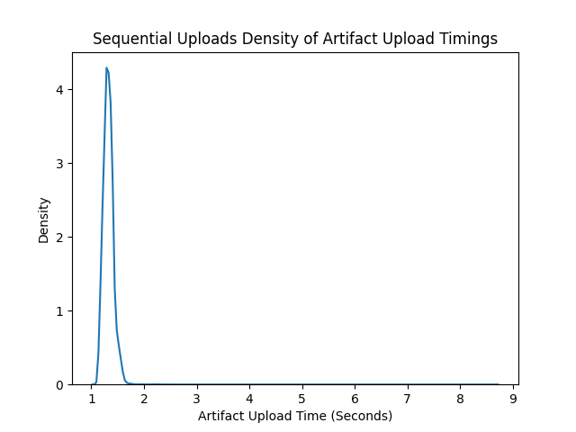
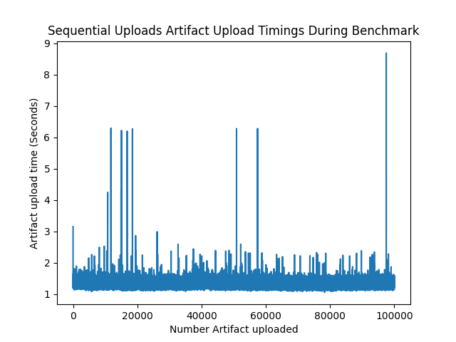
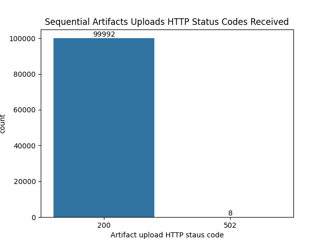

# Characterization Study of the Scalability of the https://cloudstash.io Platform

This document outlines the work carried out in order to create a characterization study of the cloudstash.io platform.
The purpose of the characterization study is to measure the: __scalability of the cloudstash.io platform as the number of stored artifacts grows.__

## System Under Test: Cloudstash

Cloudstash (available at https://cloudstash.io) is an artifact management system built entirely on AWS serverless technology.
The platform lets registered users create repositories, that can store artifacts: a zip file containing the code and generic configuration metadata of a serverless function.
Arifacts can then later be retrieved from the service.

The platform comprises a frontend webpage served using AWS Lambda (FaaS) and an AWS API Gateway (HTTP router), persistent data is stored in AWS s3 (blob storage) and AWS DynamoDB (NoSQL database).

Common for all of these technologies is that they follow a 'serverless' approach, in the sense that they are completely managed by AWS, and users pay for the service based on their usage of the services, e.g. execution time, database queries, and not for the provisioning of the resources, e.g. per minute a virtual server is rented.

The platform is developed and deployed using the serverless framework (https://www.serverless.com/) and written in Python 3.7.

## Defining Scalability

Scalability is a hard to define quality, but typically scalability is defined as the ability for a system to **scale** to meet different levels of demand.
Thus scalability in itself is a rather binary property - and more interesting is the **quality** of the scalability, i.e. "How well does the system scale?".

Therefore we need to identify some metrics that can be used to quantify the quality of the scalability. Typically scalability is measured in terms of horizontal (adding more instances of a resources) and vertical scalability (adding more resources to a given instance).
Since we are dealing with serverless computing, the scalability of the system is for the most part abstracted away from the users as part of the serverless service.
This makes it difficult to investigate the scalability of serverless-based technologies, but we can interact with the system, and we can scale this interaction, and if the system scales well, then the quality of these interactions should not change.

Since we are interested in measuring the scalability of the system as the number of stored artifacts increases, we choose two qualities of the system to quantify: the performance, and the availability of the system.
The performance will be quantified through the metric of response time for requests made to the platform, and the availability will quantified through the metrics of the HTTP response codes received when making requests to the platform, e.g. that all of our requests are handled correctly.

The assumption is that if the system scales well, then the response time should not change as we store more and more artifacts, as well as that all requests are handled correctly, no matter how many artifacts are stored in the platform.

<!-- Thus by applying a series of tests -->

<!-- e.g. the response time should be the same, no matter how many requests per second we make, all of our requests should be -->

<!-- Therefore in order to obtain some insights into the quality of the scalability -->

<!-- In terms of cloud computing, and especially serverless computing we are mostly interested in the horizontal scalability of systems, as the cloud providers make promises of horizontal scalability for the services that -->
<!-- in terms horizontal and vertical scalability. -->
<!-- Since we are interested in the scalability of platform that relies on serverless technology, -->

<!-- elasticity -->
<!-- precision -->

<!-- repeatability and reproducibility -->
<!-- isolation -->

<!-- serverless platforms evolve rapidly -->

<!-- ### Performance -->

<!-- ### Availability -->

## Benchmarking Serverless Cloud Infrastructure

Accurately benchmarking serverless technologies is hard.
The nature of the serverless paradigm means that the granular control and insight typically needed to make good benchmarks are purposefully abstracted, and hidden away from the user, in order to provide the 'serverless' experience.

Thus in order to actually acquire any insights into the system we have to adopt a black box approach to benchmarking the system.

Serverless technologies are typically provided 'as-a-service', which means that users pay for the granular usage an offered service, and thus the quality of this service is completely at the mercy of the service provider.
This means that quality of these services can change rapidly and without any warning, granted this usually a feature as providers are generally interested in offering a better service, but it means that benchmarking these systems is further complicated, as what version of a system is under test is for the most part not known.

This complicates benchmarking serverless technologies as a benchmark will be a picture of the system at a given point in time, but the next day, the provider might quietly update the service, changing the quality of the service, and thus rendering the benchmark useless apart from for historical purposes.

To alleviate these difficulties, great care should be taken when designing benchmarks for serverless technologies: benchmarks should be repeatable, reproducible, isolated and automated.

- Benchmarks should be repeatable such that they can be carried out over time, as the underlying services change, and such that these changes can be observed.
- Benchmarks should be reproducible, in the sense that they should be able to be carried out be researchers, independently of each other, and, within margin of error, these researchers should achieve the same results.
- Benchmarks should be carried out in isolation, such that the benchmark is not influenced by any optimizations of related systems, or by historical data from previous use of the technology, e.g. we do not want to run the benchmark on an existing production deployment, but instead choose to deploy a new, distinct instance of the platform, with the sole purpose of running the benchmark.
- Benchmarks should be automated, such that we can ensure that as benchmarks are run repeatedly, and by different researchers, that they are run the exact same way every time, and thus that results from different benchmarks can be compared.

<!-- ### Black Box Approach -->

<!-- ### Automation -->

<!-- ### Cloud Providers -->

<!-- ### AWS Services -->

<!-- #### Lambda -->
<!-- #### API Gateway -->
<!-- #### DynamoDB -->
<!-- #### s3 -->

## Designing Benchmarks for Scalability

Earlier in the text we put forward the assumption that due to the serverless nature of the system, the performance and the availability should be the same, irregardless of how many functions are actually stored in the Cloudstash instance being tested.
Thus we design two benchmarks to attempt to verify this assumption:

<!-- The assumption is that if the system scales well, then the response time should not change as we store more and more artifacts, as well as that all requests are handled correctly, no matter how many artifacts are stored in the platform. -->

### Benchmark 1: Sequential Artifact Uploads

The first of the two benchmarks is the `Sequential Artifact Upload` benchmark.
In this benchmark we sequentially upload a number of artifacts to a Cloudstash instance, and record the response time of the upload request, as well as the HTTP response code.

We record the response time to verify that the performance of the applications scales as the number of stored artifacts grows.
If the system scales well then we expect the response time to remain the same, with some small margin, as we upload an arbitrary number of artifacts.
From a users point of view, the experience of uploading the first and last artifact should be the same.

We record the HTTP status code to measure the availability of the system as the number of stored artifacts grows.
We expect that if the systems scales well, that all of our requests are handled correctly, and that we receive a 200 HTTP status code for all of the requests that we make.

The maximum number of artifacts to be uploaded is 100000.
This benchmarks thus verifies that 100000 artifacts can be uploaded to the platform, and that the scalability of the system is good if it behaves consistently across all of the artifact uploads.

### Benchmark 2: Load Test

TODO describe benchmark 2

# Benchmarking Setup

## Infrastructure

Benchmarks are orchestrated from the `orchestration` server.
The orchestration server serves as the centralized control point for the benchmarks and handles the actual running of benchmarks.
The orchestration server is an AWS ec2 instance, with the size 't3.medium', running Ubuntu 18.04.

Each benchmark that is started runs in a docker container on the orchestration server.
The container contains the benchmarking logic, and controls the lifecycle of the benchmark.

Each benchmark that is run deploys it's own instance of Cloudstash.
Cloudstash is deployed using the Serverless framework, which is a infrastructure-as-code framework for FaaS-based projects.
The Cloudstash deployment consists of a number AWS Lambda functions, an API Gateway, DynmoDB tables and an s3 bucket.
When the benchmark is over, the created Cloudstash instance is destroyed.

TODO serverless artillery?

## Automation

Running a benchmark is done in a completely automated way.
The user will start a benchmark by running one of the two orchestration scripts, and provide the script with the argument for the number of artifacts to upload in the sequential upload benchmark, or how many artifacts should be present in the Cloudstash instance, before running the benchmark for the load test.

The orchestration script will then start a container with the appropriate parameters and execute the entire benchmark autonomously.
The results of the benchmark are delivered in a `.csv` file to bind-mounted directory on the orchestration server.
As well as a log of events during the benchmark, mainly for debugging purposes.

## Benchmark Lifecycle

The flow of the benchmarks start with the user running the orchestration script.
The script will start a docker container, and inside the container the Python orchestration script will handle running the actual benchmark.
First the benchmark specific Cloudstash instance will be deployed, when the instance has been successfully deployed, the orchestration script will apply any needed pre-conditions, such as creating users on the instance, obtaining authentication tokens and creating artifact repositories.
Once the needed preconditions are established, the orchestration script will run the actual benchmark, either in the shape of Python code to upload artifacts, or applying an Artillery script to conduct the load tests.
Once the benchmark has completed, the benchmark results are parsed and outputted as a `.csv` file, for later analysis.
Then the deployed Cloudstash instance is destroyed, removing all traces of the deployment.
Finally the lifecycle of the benchmark is complete, and docker container stops.

## Outputs

Each benchmark produces a `.csv` file with the results from the benchmark.
The output files can be parsed with 'plots' python scripts to create different pre-defined graphs to visualize the data.

#### Benchmark 1
For the sequential artifact upload benchmark the available data points are:
- `start_time` - the start time of the request in unix time
- `end_time` - the end time of the request in unix time
- `total_time` - end_time minus start_time, the total time of the request in seconds
- `status_code` - the HTTP status code of the request
- `artifact_num` - the number artifact uploaded, counting up from 0
- `artifact_name` - the name of the artifact file
- `artifact_size` - the size in bytes of the artifact file
- `repository` - what repository the artifact was uploaded to
- `user` - the Cloudstash user

#### Benchmark 2

TODO benchmark 2

# Results

## Benchmark 1: Sequential Artifact Uploads

The results presented here were from a benchmark run on the 5th of February 2021, the running time of the benchmark was 46 hours, 48 minutes and 5 seconds.
The orchestration server was running in the `eu-north-1` (Stockholm) AWS datacenter and the cloudstash instance was deployed in the `eu-west-1` (Ireland) AWS datacenter.

The raw data from this benchmark is available in the file `cloudstash-characterization/results/8531abf7-sequential_upload-100000.csv`, in this repository.
The plots can be found in `cloudstash-characterization/results/plots`.

### Overall Observations
Overall we can see that in this benchmark the Cloudstash platform performed well, and scaled adequately to meet the needs of the benchmark, as the number of stored artifacts in the platform increased.

### Performance: Response time

The performance of the Cloudstash scaled well to meet the demand of sequentually uploading 100000 artifacts.
We can see from the below plot, that the majority of the requests had a response time of around 1.5 seconds, with very few outliers.

Looking at the next plot, which plots the toatl artifact upload time on y-axis and the number artifact uploaded on the x-axis, we can see that there are a few outliers, that have a response time above 1.5 seconds.
The cause of these outliers could be from the platform, whenever new AWS Lambda instances are created, these incur a "cold start", which will have a longer response time, due to provisioning of the Lambda instance serving the request.
Further it seems reasonable, that when making 100000 requests from one datacenter to another, over the cause of two days, that there will be some outliers, due to outside factors, networking latency, etc.

### Availability

In the below plot we show two columns that count the received HTTP status codes.
We can see that the majority of the requests were successful, and had a response code of 200, indicating that the artifact was uploaded successfully.
There was a total of 8 requests that encountered some server side error, indicated by the 502 response code.
Ideally proving the availability of the platform, all requests should have been successful, but as discussed above in terms of response time outliers, the same applies here, and we consider the 8 requests within margin of error.

## Benchmark 2: Load Tests

TODO discuss benchmark 2
